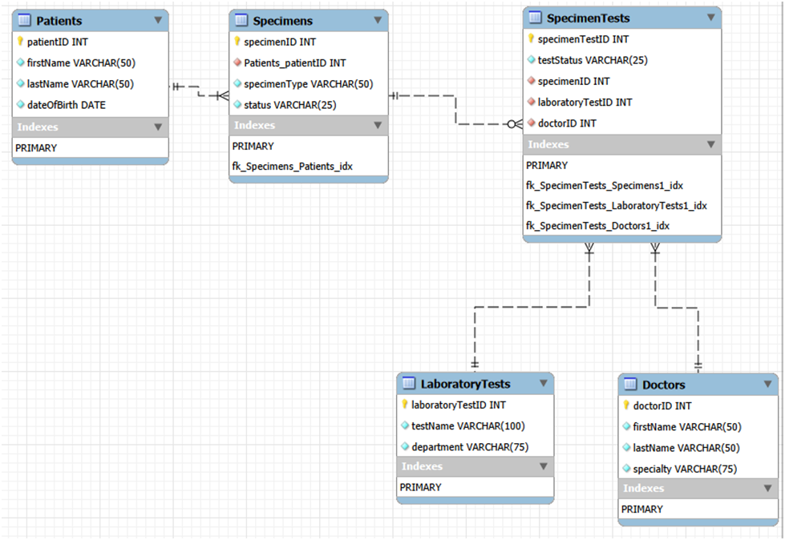

# Laboratory Information System

## Project Overview

Capital Health is a 203-bed community hospital that needs an updated
laboratory information system. The laboratory processes approximately
800 specimens and 2,000 individual specimen tests each day.

Doctors order laboratory tests for patients to guide clinical decisions,
and specimens are collected from patients and sent to the laboratory for
processing.

The proposed database connects patients, specimens, laboratory test types,
doctors, and individual test orders so laboratory staff can identify which
patient a specimen belongs to, which test was ordered, who requested it,
and the current status of the work.

The goal is to keep testing organized and searchable as specimen tests move
from collected to in-lab and completed.

## Live Website

> **Note:** You must be connected to the Oregon State University VPN for this link to work.

http://classwork.engr.oregonstate.edu:57355

## Database Schema



## Database Setup

Create a `.env` file in the project root and add your database credentials:

```env
DB_HOST=classmysql.engr.oregonstate.edu
DB_USER=cs340_USER
DB_PASSWORD=YOUR_PASSWORD
```

Replace `cs340_USER` and `YOUR_PASSWORD` with your own database credentials.

Install the project dependencies:

```terminal
npm install
```

Set up the database:

```terminal
npm run setup
```

This runs `DDL.sql` and `PL.sql` to create the database tables, sample data,
and stored procedures.

## Citations

### Starter Code
> Starter Code templates were used from Canvas Explorations for most files.

- Date: 07/25/2026
- Source URL: [OSU Canvas Exploration](https://canvas.oregonstate.edu/courses/2051721/pages/exploration-web-application-technology-2?module_item_id=26923351)

### AI Use Citation
> PL.SQL and select code blocks were made with the aide of Chatgpt

- Date: 08/05/2026
- Scope: ChatGPT helped draft the DELETE stored procedure used to demonstrate
- that the RESET procedure restores removed sample data.
- Prompt synopsis: Create a parameterized stored procedure that deletes one
- SpecimenTests row for the Step 4 RESET demonstration.
- Originality: The procedure was reviewed and edited for the group's schema.
- Source: [ChatGPT](https://chatgpt.com/)